# 📊 Szenario-Analyse: `save_memory_with_graph` mit PostgreSQL

## Konfiguration
```properties
POSTGRES_HOST=localhost
POSTGRES_PORT=5432
POSTGRES_DB=baby_skynet
POSTGRES_USER=claude
POSTGRES_PASSWORD=skynet2025
```

**→ DatabaseConfig wählt PostgreSQL** (alle Variablen gesetzt)

## Vollständige Verarbeitungspipeline

### 1. Tool-Handler Aufruf (`index.ts`)
```typescript
case 'save_memory_with_graph':
  // Tool wird aufgerufen mit:
  // - category: string (z.B. "erlebnisse")
  // - topic: string (z.B. "Wichtiger Projektfortschritt")
  // - content: string (z.B. "Heute haben wir...")
  // - forceRelationships?: any[]
  
  const result = await memoryDb.saveMemoryWithGraph(category, topic, content, forceRelationships);
```

### 2. PostgreSQL: `saveMemoryWithGraph` Methode
```typescript
async saveMemoryWithGraph(category, topic, content, forceRelationships) {
    // ❌ KEIN Aufruf von saveNewMemoryAdvanced!
    // ❌ KEINE LLM-Analyse!
    // ❌ KEINE Bedeutsamkeitsbewertung!
    
    // Schritt 1: Direkte SQL-Speicherung
    const basicResult = await this.saveNewMemory(category, topic, content);
    
    // Schritt 2: Minimale ChromaDB-Integration (falls verfügbar)
    let stored_in_chroma = false;
    if (this.chromaClient) {
        // Statische Konzept-Erstellung (KEIN LLM!)
        const concepts = [{
            concept_description: content,        // 1:1 Kopie
            concept_title: topic,               // 1:1 Kopie  
            memory_type: category,              // Unverändert
            confidence: 0.8,                    // Hardcoded
            mood: 'neutral',                    // Hardcoded
            keywords: [topic.toLowerCase()],    // Simpel
            extracted_concepts: [category]      // Statisch
        }];
        
        const chromaResult = await this.chromaClient.storeConcepts(memory, concepts);
        stored_in_chroma = chromaResult.success && chromaResult.stored > 0;
    }
    
    // Schritt 3: Neo4j-Verfügbarkeitsprüfung (KEINE echte Integration!)
    let stored_in_neo4j = false;
    let relationships_created = 0;
    if (this.neo4jClient) {
        stored_in_neo4j = true; // Nur Flag, keine echte Speicherung
    }
    
    return {
        memory_id: basicResult.id,
        stored_in_chroma: stored_in_chroma,
        stored_in_neo4j: stored_in_neo4j,
        relationships_created: relationships_created // Immer 0
    };
}
```

### 3. PostgreSQL: `saveNewMemory` (Basis-Speicherung)
```typescript
async saveNewMemory(category, topic, content) {
    // Einfache SQL-INSERT Anweisung
    const query = `
        INSERT INTO memories (category, topic, content, date, created_at) 
        VALUES ($1, $2, $3, $4, $5) 
        RETURNING id
    `;
    
    const result = await this.pool.query(query, [
        category, 
        topic, 
        content, 
        new Date().toISOString().split('T')[0],
        new Date().toISOString()
    ]);
    
    return { id: result.rows[0].id };
}
```

## Antworten auf Ihre Fragen

### ❓ "Wird die Erinnerung in Neo4j abgelegt?"
**❌ NEIN** - Neo4j-Integration ist nur ein Stub:
```typescript
if (this.neo4jClient) {
    stored_in_neo4j = true; // Nur Flag-Setting
    // KEINE echte Speicherung!
    // KEINE Relationship-Erstellung!
}
```

### ❓ "Wird die Erinnerung in ChromaDB abgelegt?"
**✅ JA** - Aber nur minimal/statisch:
```typescript
// Statische Konzepte ohne LLM-Analyse
const concepts = [{
    concept_description: content,        // Kopie des Original-Inhalts
    concept_title: topic,               // Kopie des Original-Topics
    memory_type: category,              // Unveränderte Kategorie
    confidence: 0.8,                    // Hardcoded-Wert
    mood: 'neutral',                    // Hardcoded-Wert
    keywords: [topic.toLowerCase()],    // Einfache Transformation
    extracted_concepts: [category]      // Statischer Wert
}];
```

### ❓ "Wird eine Bedeutsamkeitsanalyse durchgeführt?"
**❌ NEIN** - Überhaupt keine LLM-Integration:
- Kein `analyzer.extractAndAnalyzeConcepts()`
- Kein `analyzer.evaluateSignificance()`
- Keine Kategorisierung in Memory-Typen
- Keine Entscheidung über SQL-Speicherung
- Keine Short Memory Integration

## Vollständige Pipeline-Übersicht

```mermaid
graph TD
    A[Tool Call: save_memory_with_graph] --> B[PostgreSQL.saveMemoryWithGraph]
    B --> C[saveNewMemory - Direct SQL INSERT]
    C --> D[Static ChromaDB Concepts]
    D --> E[Neo4j Availability Check Only]
    E --> F[Return Simple Result]
    
    style C fill:#ffcccc
    style D fill:#ffffcc  
    style E fill:#ffcccc
    
    G[❌ NO LLM Analysis]
    H[❌ NO Significance Evaluation]  
    I[❌ NO Memory Type Detection]
    J[❌ NO SQL Management]
    K[❌ NO Short Memory]
```



## Vergleich: Was PostgreSQL NICHT macht (aber SQLite schon)

### SQLite Pipeline (350+ Zeilen)
```typescript
// 1. Temporäre SQL-Speicherung
const memoryResult = await this.saveNewMemory(...);

// 2. LLM-Analyse 
const analysisResult = await this.analyzer!.extractAndAnalyzeConcepts(savedMemory);

// 3. Memory-Typ-Erkennung
const memoryType = analysisResult.semantic_concepts?.[0]?.memory_type;

// 4. Bedeutsamkeitsbewertung
if (['faktenwissen', 'prozedurales_wissen'].includes(memoryType)) {
    shouldKeepInSQLite = false;
} else {
    const significanceResult = await this.analyzer!.evaluateSignificance(...);
    shouldKeepInSQLite = significanceResult.significant!;
}

// 5. SQL-Management
if (!shouldKeepInSQLite) {
    await this.deleteMemory(memoryId); // Entfernung!
}

// 6. Short Memory
await this.addToShortMemory(...);
```

### PostgreSQL Pipeline (42 Zeilen)
```typescript
// 1. Direkte SQL-Speicherung
const basicResult = await this.saveNewMemory(...);

// 2. Statische ChromaDB-Konzepte
const concepts = [{ /* hardcoded values */ }];

// 3. Neo4j-Flag
stored_in_neo4j = !!this.neo4jClient;

// 4. Fertig!
return result;
```

## Praktisches Beispiel

### Input
```javascript
category: "faktenwissen"
topic: "TypeScript Interface Syntax"  
content: "TypeScript interfaces define object shapes and can be extended..."
```

### PostgreSQL Verhalten
```javascript
// 1. Memory wird VOLLSTÄNDIG in SQL gespeichert
INSERT INTO memories VALUES ('faktenwissen', 'TypeScript Interface Syntax', '...')

// 2. Statische ChromaDB-Speicherung
chromaClient.storeConcepts(memory, [{
    concept_description: "TypeScript interfaces define...", // 1:1 Kopie
    concept_title: "TypeScript Interface Syntax",          // 1:1 Kopie
    memory_type: "faktenwissen",                           // Unverändert
    confidence: 0.8,                                       // Hardcoded
    mood: 'neutral',                                       // Hardcoded
    keywords: ["typescript interface syntax"],             // Einfach
    extracted_concepts: ["faktenwissen"]                   // Statisch
}])

// 3. Resultat
{
    memory_id: 123,
    stored_in_chroma: true,     // ChromaDB erfolgreich
    stored_in_neo4j: false,     // Neo4j nicht verfügbar
    relationships_created: 0    // Keine echte Integration
}
```

### SQLite Verhalten (zum Vergleich)
```javascript
// 1. Temporäre SQL-Speicherung
INSERT INTO memories VALUES (...)

// 2. LLM-Analyse erkennt: memoryType = "faktenwissen"
analyzer.extractAndAnalyzeConcepts() → "faktenwissen"

// 3. Automatische Entfernung aus SQL
DELETE FROM memories WHERE id = 123  // faktenwissen wird entfernt!

// 4. LLM-angereicherte ChromaDB-Speicherung
chromaClient.storeConcepts(memory, enhancedConcepts) // Mit LLM-Metadaten

// 5. Resultat
{
    memory_id: 0,               // 0 weil aus SQL entfernt!
    stored_in_chroma: true,     // ChromaDB mit LLM-Daten
    stored_in_neo4j: false,     // Neo4j nicht verfügbar  
    relationships_created: 0
}
```

## Fazit für Ihr Szenario

Bei PostgreSQL-Verwendung:

1. **Memory wird IMMER in SQL gespeichert** (keine Filterung)
2. **ChromaDB**: Ja, aber nur mit statischen Daten (kein LLM)
3. **Neo4j**: Nein, nur Verfügbarkeitsprüfung
4. **Bedeutsamkeitsanalyse**: Nein, komplett fehlend
5. **Intelligenz**: Minimal - nur ein "Database Wrapper"

**PostgreSQL = Einfache Speicherung ohne KI-Features** 🚨
